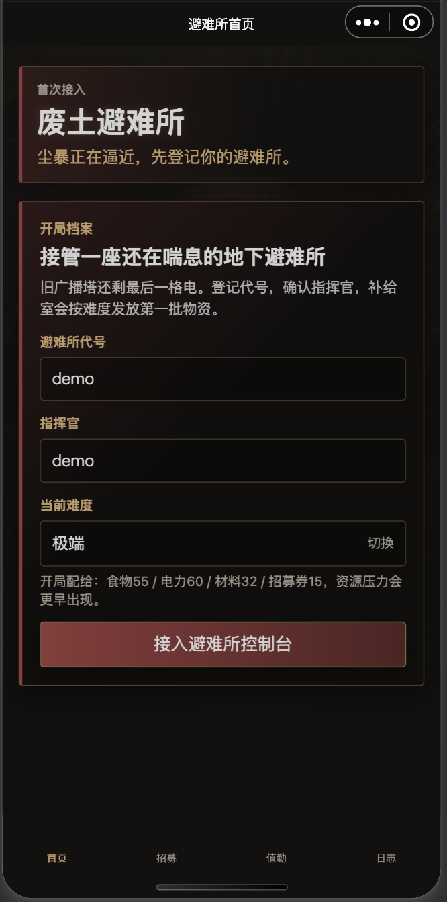
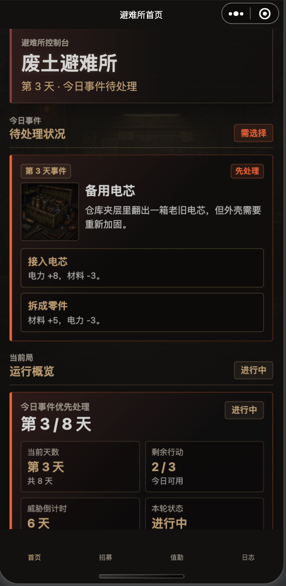
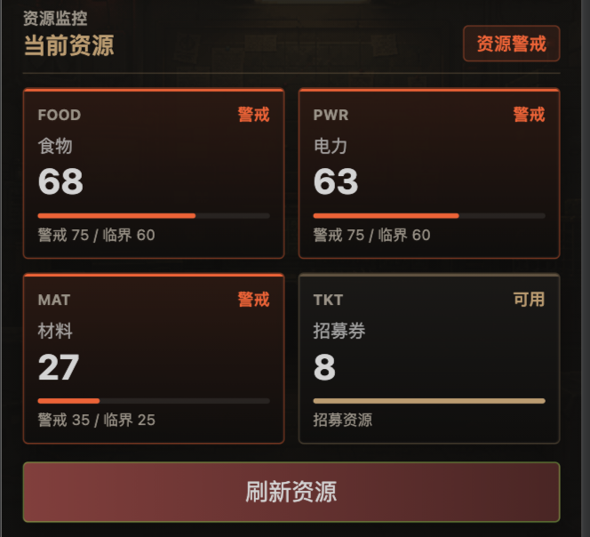
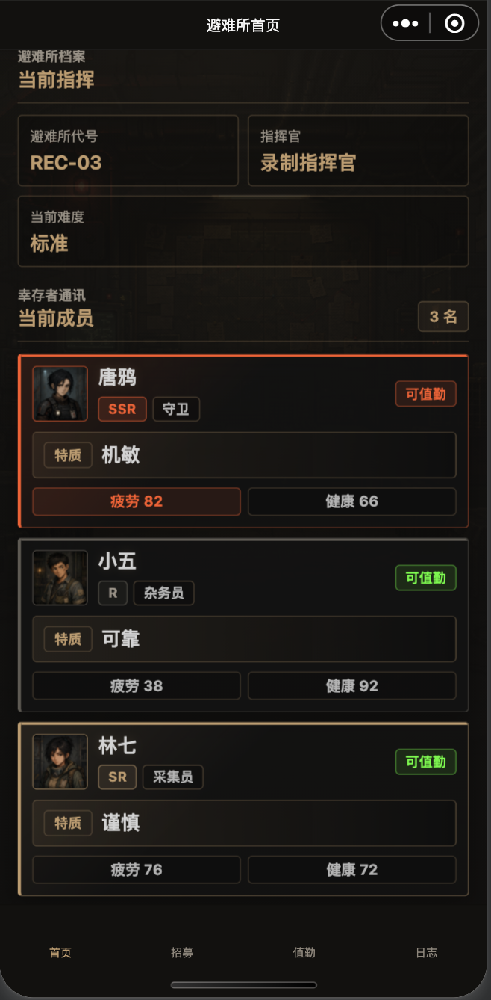
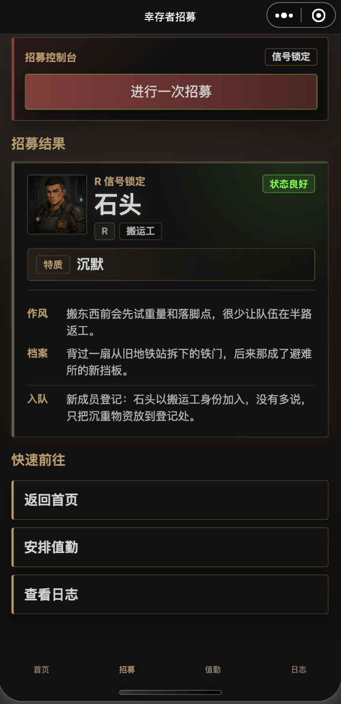
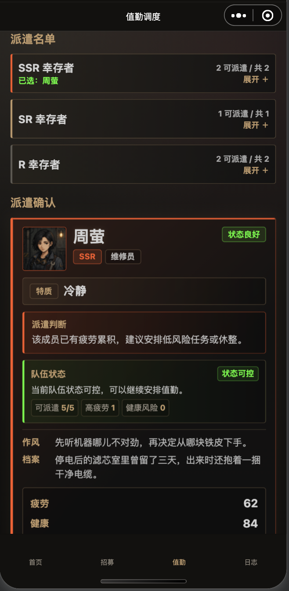
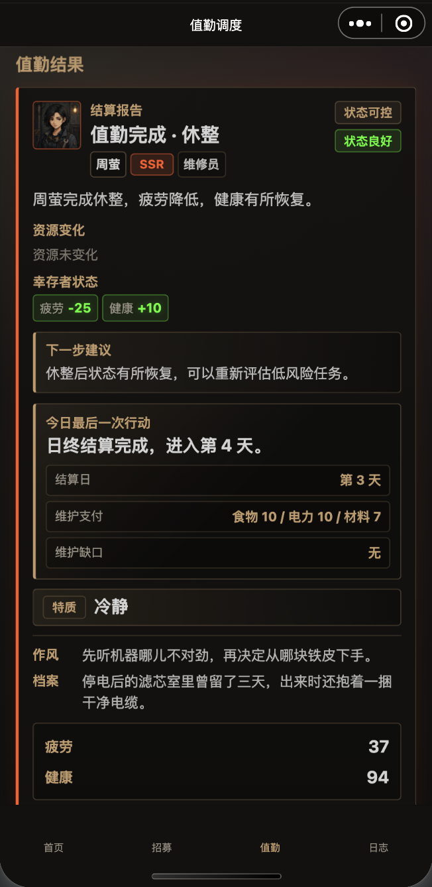
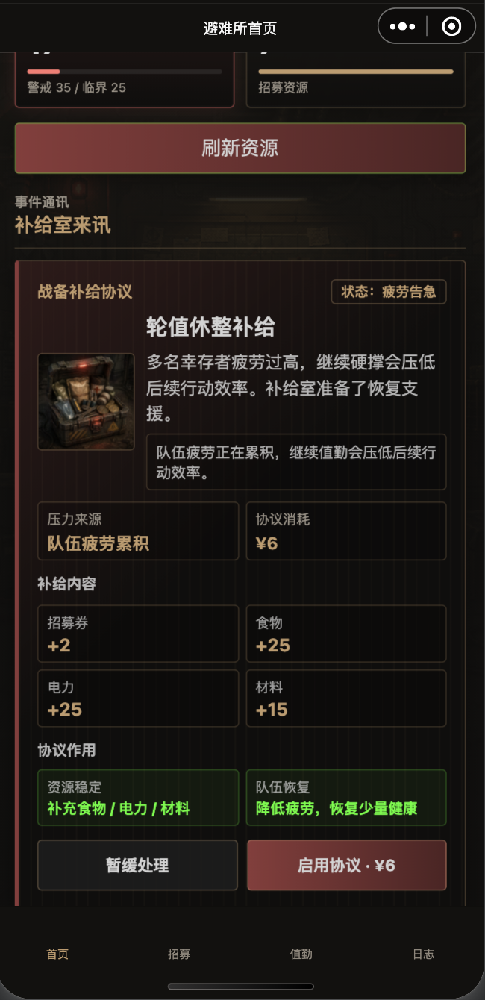
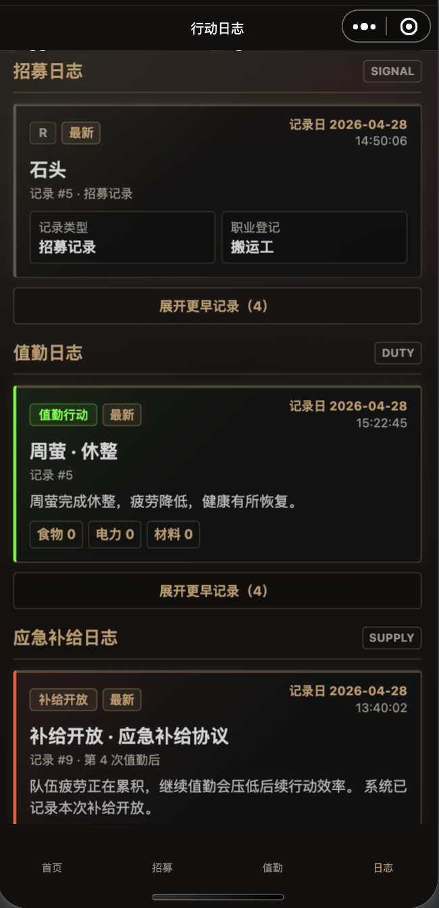
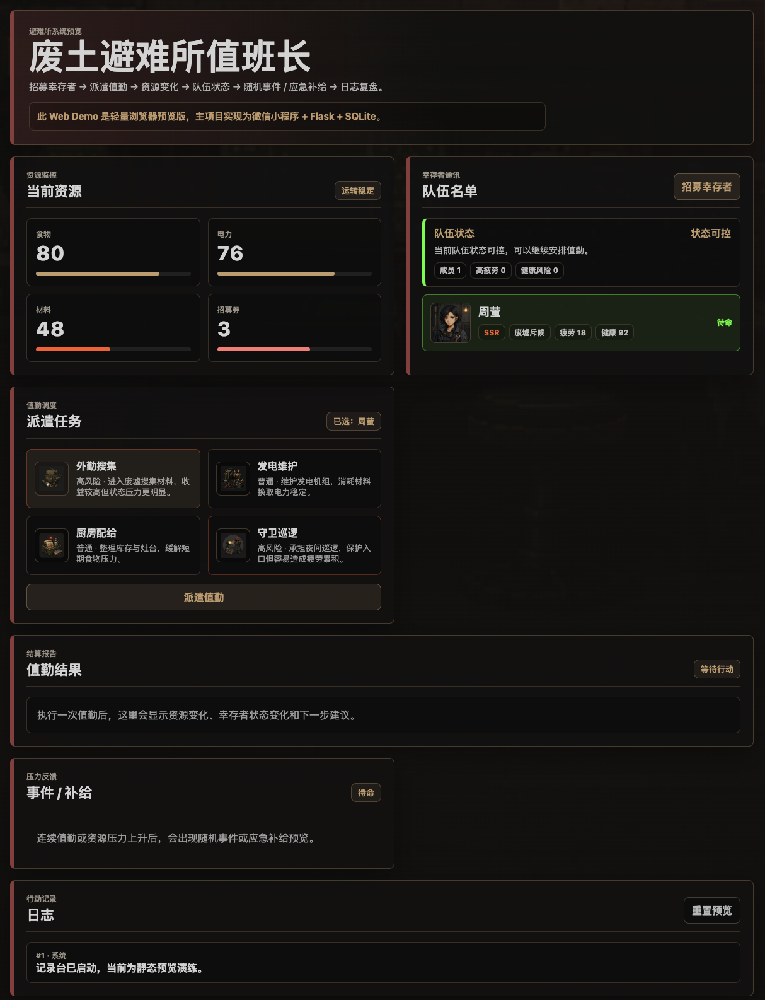

# 废土避难所值勤管理器

一个面向游戏运营 / R&D-support operations 实习作品集的轻量废土避难所管理原型。

主实现是 **WeChat Mini Program + Flask + SQLite**。仓库里的 `web-demo/` 只是静态浏览器预览，用于降低作品集评审门槛。

---

## 快速预览

在线打开互动 Web Demo：

```text
https://rayna-rrr.github.io/wasteland-shelter-demo/web-demo/
```

快速浏览静态 Web Demo：

```bash
open web-demo/index.html
```

说明：GitHub Pages 根路径可能显示仓库 README；`/web-demo/` 才是可交互的浏览器预览页面。

Web Demo 是轻量浏览器预览，使用静态前端状态模拟核心循环；它不是完整实现，也不连接 Flask / SQLite。完整原型逻辑在微信小程序 + Flask + SQLite 版本中。

---

## 项目定位

《废土避难所值勤管理器》是一个轻量避难所管理原型，用于展示：

- 如何把招募、派遣、资源变化、幸存者状态、随机事件、应急补给和日志串成一条可运行闭环
- 如何让应急补给由真实压力触发，而不是像随机商城弹窗
- 如何从游戏运营 / 研发支持运营视角，让玩家行为和系统反馈可追踪、可复盘

它不是商业化完整游戏，重点不是大规模内容量，而是用较小代码规模做出可演示、可解释、可复盘的系统循环。

---

## 核心循环

```text
Recruit survivor
-> Assign duty
-> Resources change
-> Fatigue / health change
-> Random event / emergency offer
-> Logs
```

中文流程：

```text
招募幸存者 -> 派遣值勤 -> 资源变化 -> 疲劳 / 健康变化 -> 随机事件 / 应急补给 -> 日志复盘
```

---

## 主要功能

- 幸存者招募与重复角色补偿
- 按稀有度分组的幸存者名单与值勤派遣
- 值勤结果反馈：资源变化、疲劳 / 健康变化、严重度标签、下一步建议
- 基于疲劳 / 健康的队伍状态压力提示
- 随机事件展示与事件插图
- 压力驱动的应急补给协议
- 应急补给日志：`exposed` / `closed` / `purchased`
- 静态 Web Demo 预览，便于无小程序环境时快速查看

---

## 技术栈

- WeChat Mini Program
- Python 3.9 + Flask + flask-cors
- SQLite
- HTML / CSS / JavaScript（Web Demo）
- Git / GitHub

---

## 运行方式

### 浏览器预览版快速查看

直接打开静态预览：

```bash
open web-demo/index.html
```

如果浏览器限制本地资源读取，可以在仓库根目录启动静态服务：

```bash
python3 -m http.server 8080
```

然后访问：

```text
http://localhost:8080/web-demo/
```

### 微信小程序主原型

#### 本地 AppID 配置

公开仓库中的 `miniprogram/project.config.json` 使用微信开发者工具可识别的占位 AppID：

```json
"appid": "touristappid"
```

如果需要使用自己的微信小程序 AppID，请复制本地私有配置示例：

```bash
cp miniprogram/project.private.config.example.json miniprogram/project.private.config.json
```

然后只在本地的 `miniprogram/project.private.config.json` 里把占位值改成自己的 AppID：

```json
"appid": "your-wechat-app-id"
```

不要把真实 AppID、AppSecret、token、云开发环境 ID 或其他密钥提交到公开仓库。`project.private.config.json` 已加入 `.gitignore`，用于存放微信开发者工具的本地私有配置。

#### 后端本地启动

以下命令都在仓库根目录运行。第一次启动后端前，先创建虚拟环境并安装依赖：

```bash
python3 -m venv .venv
source .venv/bin/activate
python -m pip install --upgrade pip
python -m pip install -r backend/requirements.txt
```

初始化或修复本地 SQLite 数据库：

```bash
python backend/init_db.py
```

启动 Flask 后端服务：

```bash
python backend/app.py
```

后端默认运行在：

```text
http://localhost:5001
```

然后在微信开发者工具中打开 `miniprogram/` 目录，并确认 `miniprogram/config.js` 中的接口地址指向本地 Flask 后端。

首次启动时，首页会先进入 onboarding。填写避难所代号、指挥官名字并选择难度后，才会正式进入首页、招募、值勤和日志流程。

---

## 浏览器预览版与小程序主实现对比

| 项目 | Web Demo | Mini Program 主实现 |
| --- | --- | --- |
| 用途 | 快速浏览作品集效果 | 真实原型实现 |
| 运行方式 | 浏览器打开 `web-demo/index.html` | 微信开发者工具 + Flask 后端 |
| 数据 | 静态前端 mock state | Flask API + SQLite |
| 结算 | 前端简化模拟 | 后端实际逻辑 |
| 日志 | 页面内临时记录 | SQLite 日志接口 |
| 适合场景 | 招聘方快速预览 | 深入查看项目结构和完整闭环 |

---

## 作品集价值

从游戏运营 / R&D-support operations 角度，这个项目重点展示：

- 系统规则、玩家操作、资源压力、幸存者状态和日志如何连接成闭环
- 应急补给如何由资源和队伍压力触发，而不是随机出现的商城弹窗
- 日志如何记录招募、值勤和补给行为，让玩家 / 系统行为可回看
- 视觉素材如何提升可读性，同时不替代系统设计本身
- 一个轻量原型如何逐步从“功能可跑”推进到“行为可解释、结果可复盘”

---

## 项目范围与限制

当前项目保持诚实范围：

- 不是商业-ready 完整游戏
- Web Demo 不是完整小程序，只是静态预览
- 数值平衡仍是 demo 级别，主要用于表达压力循环
- LLM 不在核心运行时逻辑中
- 没有账号、线上服务、支付、完整运营后台或复杂数据分析平台

后续可以继续加强：

- 更细的数值平衡
- 更完整的随机事件配置
- 更清晰的日志分析视图
- GitHub Pages / 作品集部署 polish
- 更系统化的运营复盘说明

---

## 截图与演示预览

以下截图按项目核心循环排列，便于快速浏览作品集演示重点。

### 入口 / 初始化



展示进入主循环前的避难所登记与初始化状态。

### 首页事件概览



展示第 3 天避难所状态、待处理事件、事件插图、玩家选择和当前轮次信息。

### 首页资源状态



展示当前资源与压力背景，说明值勤和应急补给决策的来源。

### 首页队伍名单



展示幸存者头像、稀有度、职业、疲劳、健康和可值勤状态。

### 招募结果



展示幸存者招募反馈，包括头像、稀有度、职业和结果提示。

### 值勤派遣



展示按稀有度分组的幸存者列表、选中角色详情、派遣判断和队伍状态反馈。

### 值勤结果



展示派遣后的结果报告，包括幸存者状态变化、资源变化、严重度、下一步建议和日结反馈。

### 应急补给



展示由压力触发的应急补给协议，包括压力来源、资源支援、队伍恢复和玩家响应选项。

### 日志概览



展示招募、值勤和应急补给日志，让玩家操作和系统触发行为可回看。

### 浏览器预览版



展示静态浏览器预览，便于不打开微信开发者工具也能快速查看项目效果。

---

## 仓库结构

```text
wasteland-shelter-demo/
├── backend/
│   ├── app.py
│   ├── init_db.py
│   └── data/
├── miniprogram/
│   ├── app.js
│   ├── app.json
│   ├── pages/
│   │   ├── home/
│   │   ├── gacha/
│   │   ├── duty/
│   │   └── logs/
│   ├── assets/
│   └── utils/
├── web-demo/
│   ├── index.html
│   ├── style.css
│   └── app.js
├── docs/
├── AGENTS.md
└── README.md
```

---

## 说明

本项目重点是“轻量游戏原型 + 系统设计表达 + 作品集展示”。README 只描述当前仓库已经实现的内容和明确的预览方式，不宣称覆盖完整商业游戏所需的战斗、建筑、账号、支付或线上运营系统。
